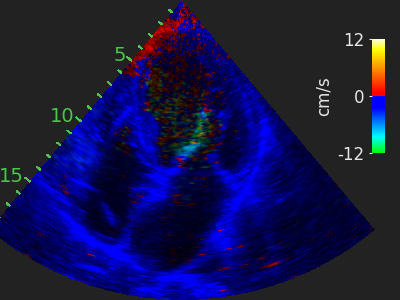
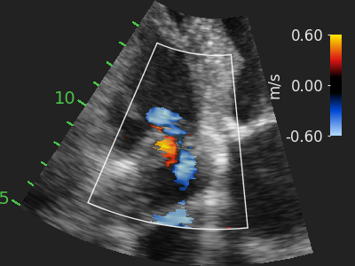
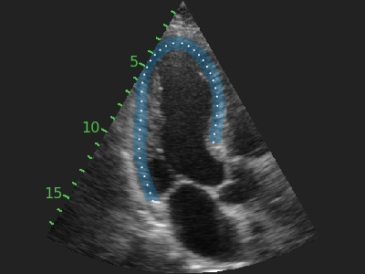

<h1 align="center">EchoXFlow</h1>

<p align="center">
  <strong>A Beamspace Echocardiography Dataset for Cardiac Motion, Flow, and Function</strong>
</p>

<p align="center">
  <a href="https://huggingface.co/datasets/Ahus-AIM/EchoXFlow">
    
  </a>
  <a href="http://arxiv.org/abs/2605.05447">
    
  </a>
  <a href="https://github.com/Ahus-AIM/EchoXFlow/actions/workflows/ci.yml">
    
  </a>
</p>

---

## Overview

**EchoXFlow** provides echocardiography recordings stored as Croissant metadata and Zarr recording stores.

This repo supports parsing, visualisation and dataloading of time-resolved 1D, 2D, and 3D B-mode and Doppler data.

---

## Highlights

- Read EchoXFlow data from **Croissant metadata** and **Zarr stores**
- Discover recordings directly from metadata
- Load typed streams for imaging, Doppler, and ECG
- Render frames and videos for inspection
- Use scaffolded examples for segmentation and prediction tasks

---

## Benchmark Tasks

<table>
  <tr>
    <td align="center">
      <strong><a href="tasks/tissue_doppler">Task 1: Tissue Velocity</a></strong><br>
      <a href="tasks/tissue_doppler">
        
      </a>
    </td>
    <td align="center">
      <strong><a href="tasks/color_doppler">Task 2: Blood Flow</a></strong><br>
      <a href="tasks/color_doppler">
        
      </a>
    </td>
    <td align="center">
      <strong><a href="tasks/segmentation">Task 3: LV Segmentation</a></strong><br>
      <a href="tasks/segmentation">
        
      </a>
    </td>
  </tr>
</table>

---

## Dataset Setup

Download the dataset from:

**🤗 https://huggingface.co/datasets/Ahus-AIM/EchoXFlow**

Then set the dataset root in [src/echoxflow/config/defaults.yml](src/echoxflow/config/defaults.yml):

```yaml
data:
  root: "/path/to/EchoXFlow"
```

Alternatively, set:

```bash
export ECHOXFLOW_DATA_ROOT=/path/to/EchoXFlow
```

---

## Reproduce Our Results

This workflow is under development. Generate the dataset statistics table with
[scripts/croissant_summary_table.py](scripts/croissant_summary_table.py):

```bash
uv run python scripts/croissant_summary_table.py /path/to/EchoXFlow/croissant.json
```

Run the benchmark matrix with [scripts/run_full_benchmark.sh](scripts/run_full_benchmark.sh):

```bash
scripts/run_full_benchmark.sh --data-root /path/to/EchoXFlow --cv --gpus 0,1,2
```

---

## Installation

```bash
uv venv
uv pip install --editable . --requirement requirements-dev.txt
```

---

## Quick Start

```python
from pathlib import Path

from echoxflow import (
    find_recordings,
    load_croissant,
    open_recording,
    render_recording_video,
)

catalog = load_croissant("/path/to/EchoXFlow/croissant.json")

records = find_recordings(
    croissant=catalog,
    content_types=(
        "2d_brightness_mode",
        "2d_color_doppler_velocity",
        "2d_color_doppler_power",
    ),
    require_all=True,
)

record = records[0]

output = Path("outputs/color_doppler.mp4")
render_recording_video(record, output, view_mode="both")

store = open_recording(record)
power = store.load_stream("2d_color_doppler_power")

print(power.data.shape)
```

---

## Development

```bash
uv run pre-commit install
uv run pre-commit run --all-files
```

---

## Citation

```bibtex
@dataset{echoxflow,
  title = {EchoXFlow},
  year = {2026}
}
```
