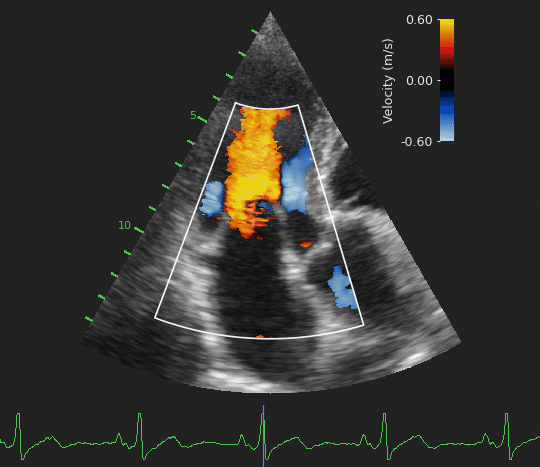

# Task 2: Estimation of Blood Velocity

<p align="center">
  
</p>

Predict color Doppler velocity, power, and local variation from B-mode clips. The task learns blood-flow appearance from the brightness-mode sequence for the same cardiac window.

The benchmark metrics are `velocity_l1`, `power_l1`, and `variation_l1`, reported on the validation split with the task defaults.

```bash
uv run python -m tasks.train color_doppler --data-root /path/to/EchoXFlow
```
