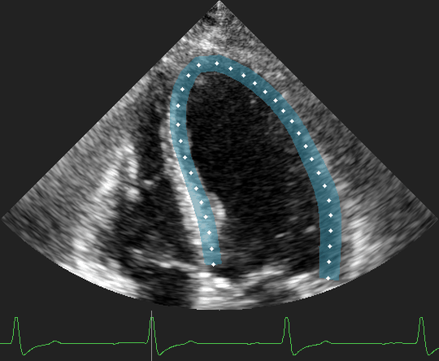

# Task 3: Segmentation of Myocardium and Endocardium

<p align="center">
  
</p>

Segment the left-ventricle myocardium and endocardium from B-mode clips with contour annotations. The task predicts the LV structures frame by frame for downstream shape and function analysis.

The benchmark metric is `dice_mean`, reported on the validation split with the task defaults.

```bash
uv run python -m tasks.train segmentation --data-root /path/to/EchoXFlow
```
