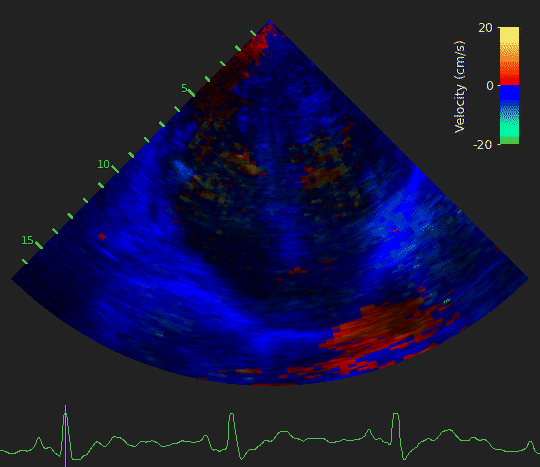

# Task 1: Estimation of Tissue Velocity

<p align="center">
  
</p>

Predict dense tissue Doppler velocity maps from B-mode clips. The task uses the brightness-mode sequence as input and estimates myocardial tissue velocity over the same temporal window.

The benchmark metric is `velocity_l1`, reported on the validation split with the task defaults.

```bash
uv run python -m tasks.train tissue_doppler --data-root /path/to/EchoXFlow
```
